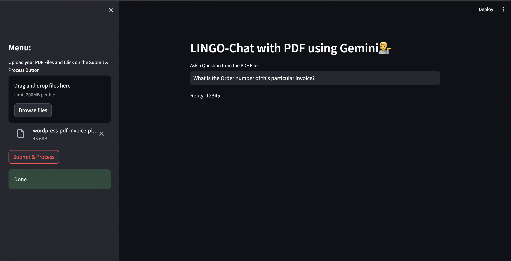

# LINGO-Chat with PDF using Gemini💁

This application, named **LINGO-Chat with PDF using Gemini💁**, is designed to facilitate conversational interactions with text extracted from PDF files. The tool employs Streamlit for the user interface and utilizes various libraries for PDF processing, language modeling, and conversational AI.

## How to Use

1. **Upload PDF Files**: Begin by uploading one PDF files containing the information you want to inquire about.

2. **Ask a Question**: After uploading the PDF file, you'll be prompted to enter your question related to the content of the uploaded PDFs.

3. **Get Response**: Once you've submitted your question, the system will process the text from the PDF files and generate a response based on the context of the uploaded documents.

## Code Components
- chapdf1.py: This Python script contains the main functionalities of the application.
- PDF Processing: Extracts text from uploaded PDF files.
- Text Chunking: Splits the extracted text into manageable chunks.
- Vectorization: Converts text chunks into embeddings for similarity search.
- Conversational AI: Utilizes a conversational chain to generate responses based on user questions.
- User Interface: Implements the Streamlit-based user interface for interaction


## Dependencies

Ensure you have the following dependencies installed:

- `streamlit`: For building the user interface.
- `google-generativeai`: For accessing Google's Generative AI capabilities.
- `python-dotenv`: For loading environment variables from a `.env` file.
- `langchain`: For various language processing tasks.
- `PyPDF2`: For extracting text from PDF files.
- `faiss-cpu`: For similarity search.
- `chromadb`: Required by `langchain` for language processing tasks.
- `langchain_google_genai`: Integrates Google's Generative AI with Langchain.


## Usage

1. Clone repostory:
```
git clone https://github.com/SequenZee/LINGO.git
```

2. Creation of virtual environment:
```
conda create -p venv python==3.11 -y
```

3. Add .env file(refer .env_sample):
```
GOOGLE_API_KEY="YOUR_API_KEY"
```

4. Install dependencies via pip:
```
pip install -r requirements.txt
```

5. Running the application:
```
streamlit run chatpdf1.py
```

Before running the application, ensure you have set up your environment variables, particularly the GOOGLE_API_KEY, which is required for accessing Google's Generative AI capabilities. You can set this key in a .env file in the same directory as the script.

## Hosting

- Render

  🔗  [LINGO - Visit site](https://lingo-d0hl.onrender.com/)

## Output



